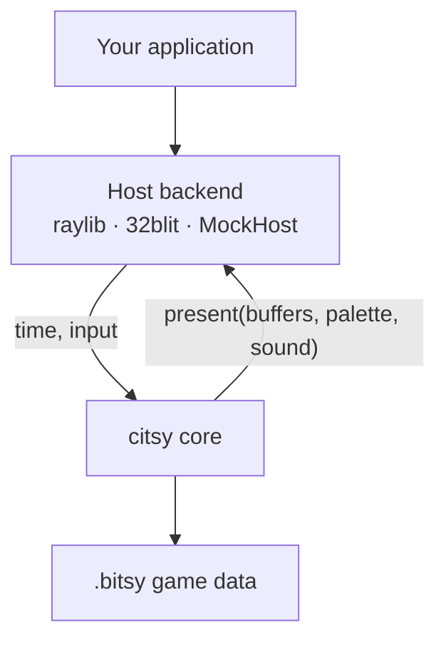

# citsy

A **headless C++** reimplementation of the [Bitsy](https://bitsy.org) game engine — the little engine for little games, worlds, and stories.

citsy is engine only. It parses `.bitsy` data, simulates the world, and writes logical framebuffers and audio parameters. A separate **Host** backend turns those buffers into pixels and sound.

<div class="hero-actions" markdown>

[Get started](getting-started.md){ .md-button .md-button--primary }
[Host API](host.md){ .md-button }
[GitHub](https://github.com/TeriyakiGod/citsy){ .md-button }

</div>

<div class="grid cards" markdown>

-   :material-cpu-64-bit: **Headless core**

    ---

    Zero window, GPU, or audio libraries. The `citsy` target is portable C++20.

-   :material-puzzle: **Pluggable Host**

    ---

    Implement `citsy::Host` and embed the engine in a jam game, handheld, or test harness.

-   :material-file-document: **Bitsy files**

    ---

    Load games exported from the Bitsy editor. Rooms, dialog, items, and scripts stay compatible.

-   :material-test-tube: **Testable**

    ---

    `MockHost` records every frame. Core tests run in CI with no display.

</div>

## How it fits together



Each frame:

1. The host reports elapsed time and button state.
2. The engine steps simulation — movement, dialog, transitions, sound.
3. The engine writes memory blocks (128×128 video, 16×16 maps, textbox, two square-wave channels).
4. The host blits those blocks and plays audio. The engine never calls platform APIs.

## Quick start

```bash
git clone https://github.com/TeriyakiGod/citsy.git
cd citsy
cmake -B build -DCMAKE_BUILD_TYPE=Release
cmake --build build
ctest --test-dir build
```

Then embed the engine by implementing `citsy::Host`. See [Getting started](getting-started.md) for a full sketch.

## Guides

| Guide | Contents |
|---|---|
| [Getting started](getting-started.md) | Clone, build, and embed the engine |
| [Architecture](architecture.md) | Layers, modules, memory blocks, data flow |
| [Host API](host.md) | Buttons, buffers, `present()`, MockHost |
| [Building](tools.md) | CMake options, compilers, backends |
| [Testing](testing.md) | Catch2, fixtures, writing tests |
| [Bitsy data model](bitsy/data-model.md) | `PAL`, `TIL`, `SPR`, `ROOM`, … |
| [Dialog scripting](bitsy/dialog.md) | Variables, lists, `{end}` / `{exit}` |
| [Roadmap](roadmap.md) | Phases and compatibility |

!!! note "Not affiliated"

    This is a clean-room engine inspired by Bitsy. It is not affiliated with Adam Le Doux or the official Bitsy project. Game data produced by the Bitsy editor (`.bitsy` files) is the intended interchange format.
